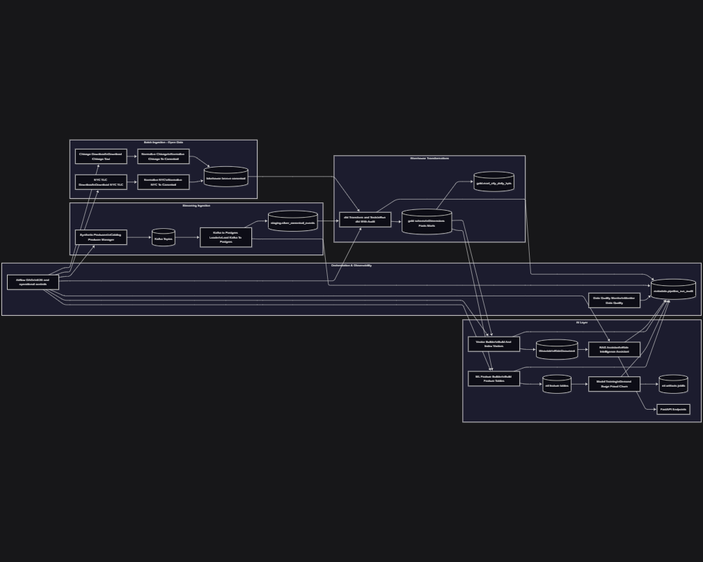
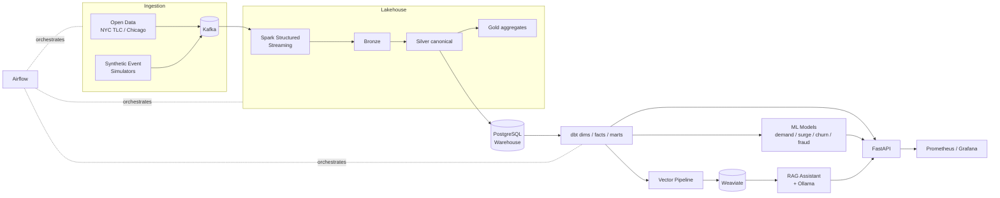

# Ride-Hailing Data & AI Platform

An end-to-end, enterprise-grade **data engineering and AI platform** for a ride-hailing business, built to run entirely on a local machine with Docker and designed with a clear migration path to Azure-native services.

The platform covers the full lifecycle: real-time event ingestion, streaming lakehouse processing, a dimensional warehouse, machine learning, a vector-based RAG assistant, serving APIs, observability, governance, and CI/CD hardening.



---

## Highlights

- **Streaming-first lakehouse** — Kafka → Spark Structured Streaming → Bronze / Silver / Gold layers.
- **Dimensional warehouse** — dbt models (dimensions, facts, KPI marts) on PostgreSQL with tests.
- **Machine learning** — demand forecasting, surge pricing, churn, and fraud models with a shared feature pipeline.
- **Vector + RAG** — embedding pipeline into Weaviate and a retrieval-augmented assistant served via Ollama.
- **Serving layer** — FastAPI endpoints for analytics, model inference, and RAG.
- **Observability** — Prometheus metrics, Grafana dashboards, structured logging, data-quality auditing, and a unified `metadata.pipeline_run_audit` trail.
- **Orchestration** — Airflow DAGs running containerized jobs end to end.
- **Governance & hardening** — data contracts, access policy, Azure migration blueprint, and a CI/CD workflow.

---

## Architecture Overview



---

## Tech Stack

| Layer | Technology |
|-------|-----------|
| Ingestion / Messaging | Apache Kafka |
| Stream Processing | Apache Spark (Structured Streaming) |
| Storage / Lakehouse | Parquet (Bronze/Silver/Gold), PostgreSQL |
| Transformation | dbt |
| Machine Learning | scikit-learn |
| Vector Store | Weaviate |
| LLM / RAG | Ollama |
| Serving | FastAPI |
| Orchestration | Apache Airflow |
| Observability | Prometheus, Grafana |
| Containerization | Docker, Docker Compose |
| CI/CD | GitHub Actions |

---

## Repository Structure

```
api/            FastAPI serving layer (analytics, inference, RAG)
config/         Source catalog, contracts, governance, migration, scaling, release policies
docker/         Compose layers, service configs (grafana, prometheus, kafka, postgres, etc.)
docs/           Stage theory docs, architecture, ERDs, operations runbooks, standards
ingestion/      Open-data and synthetic event producers
lakehouse/      Bronze / Silver / Gold data layers (gitignored data)
ml/             Feature pipeline, model training, artifacts
orchestration/  Airflow DAGs
processing/     Spark streaming jobs
rag/            Retrieval-augmented assistant
scripts/        Operational scripts (loaders, audits, validators, start/stop)
ui/             Streamlit interface
vector/         Embedding + indexing pipeline
warehouse/      dbt project
```

---

## Getting Started

### Prerequisites
- Docker Desktop (Linux containers + WSL2 integration)
- Python 3.11+ (for running scripts locally)

### 1. Configure environment

Copy the example environment file and adjust values as needed:

```powershell
Copy-Item .env.example .env
```

Local Docker credentials live in `docker/compose/.env.local` (and `.env.enterprise-sim` for high-load simulation). These files are gitignored.

### 2. Start the stack

From the repository root:

```powershell
# Core services
docker compose --env-file docker/compose/.env.local -f docker/compose/docker-compose.base.yml up -d

# Core + Spark + Monitoring
docker compose --env-file docker/compose/.env.local `
  -f docker/compose/docker-compose.base.yml `
  -f docker/compose/docker-compose.spark.yml `
  -f docker/compose/docker-compose.monitoring.yml up -d
```

See [docker/compose/README.md](docker/compose/README.md) for full start/stop profiles, Airflow orchestration, and Kafka topic bootstrap.

### 3. Service endpoints

| Service | URL |
|---------|-----|
| FastAPI | http://localhost:8000/health |
| Grafana | http://localhost:3000 |
| Prometheus | http://localhost:9090 |
| Weaviate | http://localhost:8080/v1/.well-known/ready |
| Spark UI | http://localhost:8081 |
| Airflow | http://localhost:8088 |
| Streamlit | http://localhost:8501 |

---

## Build Stages

The platform was built in 18 incremental stages (see [STAGE_INDEX.md](STAGE_INDEX.md) and [docs/stages/](docs/stages)):

| Stage | Theme |
|-------|-------|
| 0–2 | Business context, architecture, deep theory foundation |
| 3–4 | Data source strategy (open + synthetic), AI-ready modeling |
| 5 | Full Docker infrastructure setup |
| 6–7 | Kafka ingestion & Spark streaming (Bronze/Silver/Gold) |
| 8 | Dimensional modeling with dbt |
| 9 | ML modeling & feature pipeline |
| 10–11 | Vector embedding pipeline & RAG assistant |
| 12 | FastAPI platform API layer |
| 13 | Observability & logging |
| 14 | Enterprise scalability & multi-city expansion |
| 15 | Security, governance & data contracts |
| 16 | Azure enterprise migration blueprint |
| 17 | CI/CD & production hardening |

Current progress is tracked in [CURRENT_STAGE.md](CURRENT_STAGE.md).

---

## Orchestration

Airflow runs the full pipeline through containerized jobs:

- **`ride_hailing_e2e_orchestrator`** — end-to-end ingestion → Spark → dbt → ML → vector → RAG → data quality.
- **`ride_hailing_operational_controls`** — start/stop controls for continuous Spark streams and operational tasks.

Every task is audit-logged to `metadata.pipeline_run_audit` with run status, command details, and Airflow context.

---

## CI/CD

GitHub Actions ([.github/workflows/ci.yml](.github/workflows/ci.yml)) runs linting, JSON contract validation, YAML config validation, and a contract-validator smoke check on every push and pull request. Release gates and resilience requirements are defined in [config/release/production_hardening_policy.yaml](config/release/production_hardening_policy.yaml).

---

## Security Notes

- Real secrets are never committed — environment files (`.env`, `.env.*`) are gitignored; only `.env.example` templates are tracked.
- Credentials in `.env.example` and code fallbacks are **local-development placeholders** only. Rotate them before any real deployment.
- Production guidance: use a secret manager / key vault, least-privilege access, and an audit trail (see [docs/standards/](docs/standards)).

---

## License

This project is provided for educational and demonstration purposes.
