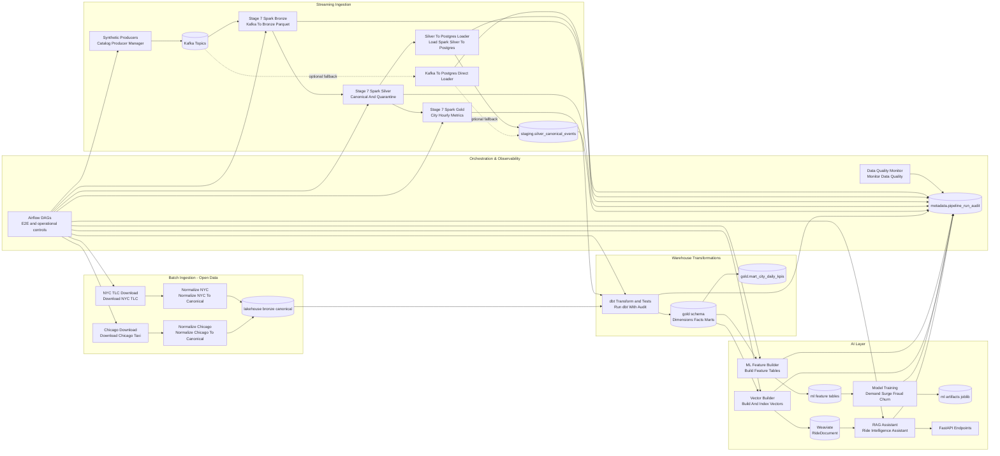

# Ride-Hailing Data Flow (Streaming + Batch + Transformations + AI)

## Notes
- Streaming lane and batch lane both converge into warehouse transformations before AI consumption.
- Spark Stage 7 runs in Airflow trigger-once mode for finite orchestration and feeds `staging.silver_canonical_events` via Spark Silver loader when enabled.
- Current resilient default for e2e is direct loader path (`run_stage7_spark_once=false`, `run_direct_kafka_loader=true`) to guarantee deterministic orchestration while Spark package/runtime hardening continues.
- Spark runtime now uses explicit submit path and connector settings (`spark-sql-kafka-0-10_2.12:3.5.1`, `spark.jars.ivy=/tmp/.ivy2`).
- Vector and RAG tasks resolve service URLs from environment (`WEAVIATE_URL`, `OLLAMA_URL`) for Docker network correctness.
- Stage 14 introduces multi-city scaling policy with city/date partitioning, capacity tiers, and configuration-driven city onboarding (`config/scaling/multi_city_expansion.yaml`).
- Airflow controls selective stage execution (ingestion-only, AI-only, DQ-only, full e2e).
- Centralized run auditing captures status, timing, and task context in `metadata.pipeline_run_audit`.
