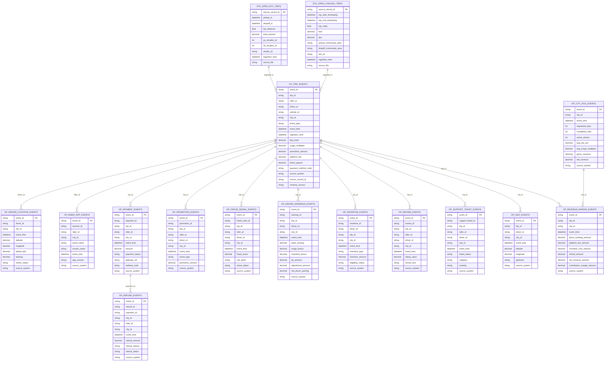

# ERD - Operational Canonical Model

```mermaid
erDiagram
    OP_TRIP_EVENTS {
        string event_id PK
        string trip_id
        string rider_id
        string driver_id
        string vehicle_id
        string city_id
        string event_type
        datetime event_time
        datetime ingestion_time
        decimal fare_total
        decimal surge_multiplier
        decimal promotion_amount
        decimal platform_fee
        decimal driver_payout
        string payment_method_code
        string source_system
        string source_record_id
        string schema_version
    }

    OP_DRIVER_LOCATION_EVENTS {
        string event_id PK
        string driver_id
        string city_id
        datetime event_time
        decimal latitude
        decimal longitude
        decimal speed_kph
        decimal bearing
        string online_status
        string source_system
    }

    OP_RIDER_APP_EVENTS {
        string event_id PK
        string session_id
        string rider_id
        string city_id
        string event_name
        string screen_name
        datetime event_time
        string app_version
        string source_system
    }

    OP_PAYMENT_EVENTS {
        string event_id PK
        string payment_id
        string trip_id
        string rider_id
        string city_id
        datetime event_time
        decimal amount
        string payment_status
        string gateway_ref
        string method_code
        string source_system
    }

    OP_REFUND_EVENTS {
        string event_id PK
        string refund_id
        string payment_id
        string trip_id
        string rider_id
        string city_id
        datetime event_time
        decimal refund_amount
        string refund_reason
        string refund_status
        string source_system
    }

    OP_PROMOTION_EVENTS {
        string event_id PK
        string promotion_id
        string trip_id
        string rider_id
        string driver_id
        string city_id
        datetime event_time
        string event_type
        decimal promotion_amount
        string source_system
    }

    OP_FRAUD_SIGNAL_EVENTS {
        string event_id PK
        string fraud_case_id
        string trip_id
        string rider_id
        string driver_id
        string city_id
        datetime event_time
        decimal fraud_score
        string risk_band
        string action_taken
        string source_system
    }

    OP_DRIVER_EARNINGS_EVENTS {
        string event_id PK
        string earning_id
        string trip_id
        string driver_id
        string city_id
        datetime event_time
        decimal base_earning
        decimal surge_bonus
        decimal incentive_bonus
        decimal tip_amount
        decimal adjustment_amount
        decimal net_driver_earning
        string source_system
    }

    OP_INCENTIVE_EVENTS {
        string event_id PK
        string incentive_id
        string driver_id
        string trip_id
        string city_id
        datetime event_time
        string incentive_type
        decimal incentive_amount
        string eligibility_status
        string source_system
    }

    OP_REVIEW_EVENTS {
        string event_id PK
        string review_id
        string trip_id
        string rider_id
        string driver_id
        string city_id
        datetime event_time
        decimal rating_value
        string review_text
        string source_system
    }

    OP_SUPPORT_TICKET_EVENTS {
        string event_id PK
        string support_ticket_id
        string trip_id
        string rider_id
        string driver_id
        string city_id
        datetime event_time
        string ticket_status
        string category
        string severity
        string source_system
    }

    OP_GEO_EVENTS {
        string event_id PK
        string trip_id
        string driver_id
        string city_id
        datetime event_time
        decimal latitude
        decimal longitude
        string geohash
        string source_system
    }

    OP_CITY_AGG_EVENTS {
        string event_id PK
        string city_id
        datetime event_time
        int requested_trips
        int completed_trips
        int active_drivers
        decimal avg_eta_sec
        decimal avg_surge_multiplier
        decimal gross_revenue
        decimal net_revenue
        string source_system
    }

    OP_REVENUE_MARGIN_EVENTS {
        string event_id PK
        string trip_id
        string city_id
        datetime event_time
        decimal gross_booking_amount
        decimal platform_fee_amount
        decimal incentive_cost_amount
        decimal refund_amount
        decimal net_revenue_amount
        decimal contribution_margin_amount
        string source_system
    }

    STG_OPEN_NYC_TRIPS {
        string source_record_id PK
        datetime pickup_ts
        datetime dropoff_ts
        float trip_distance
        decimal total_amount
        int pu_location_id
        int do_location_id
        string vendor_id
        datetime ingestion_time
        string source_file
    }

    STG_OPEN_CHICAGO_TRIPS {
        string source_record_id PK
        datetime trip_start_timestamp
        datetime trip_end_timestamp
        float trip_miles
        decimal fare
        decimal tips
        string pickup_community_area
        string dropoff_community_area
        string taxi_id
        datetime ingestion_time
        string source_file
    }

    OP_TRIP_EVENTS ||--o{ OP_PAYMENT_EVENTS : trip_id
    OP_PAYMENT_EVENTS ||--o{ OP_REFUND_EVENTS : payment_id
    OP_TRIP_EVENTS ||--o{ OP_PROMOTION_EVENTS : trip_id
    OP_TRIP_EVENTS ||--o{ OP_FRAUD_SIGNAL_EVENTS : trip_id
    OP_TRIP_EVENTS ||--o{ OP_DRIVER_EARNINGS_EVENTS : trip_id
    OP_TRIP_EVENTS ||--o{ OP_INCENTIVE_EVENTS : trip_id
    OP_TRIP_EVENTS ||--o{ OP_REVIEW_EVENTS : trip_id
    OP_TRIP_EVENTS ||--o{ OP_SUPPORT_TICKET_EVENTS : trip_id
    OP_TRIP_EVENTS ||--o{ OP_DRIVER_LOCATION_EVENTS : driver_id
    OP_TRIP_EVENTS ||--o{ OP_RIDER_APP_EVENTS : rider_id
    OP_TRIP_EVENTS ||--o{ OP_GEO_EVENTS : trip_id
    OP_TRIP_EVENTS ||--o{ OP_REVENUE_MARGIN_EVENTS : trip_id
    OP_CITY_AGG_EVENTS ||--o{ OP_REVENUE_MARGIN_EVENTS : city_id

    STG_OPEN_NYC_TRIPS ||--o{ OP_TRIP_EVENTS : ingested_to
    STG_OPEN_CHICAGO_TRIPS ||--o{ OP_TRIP_EVENTS : ingested_to
```
