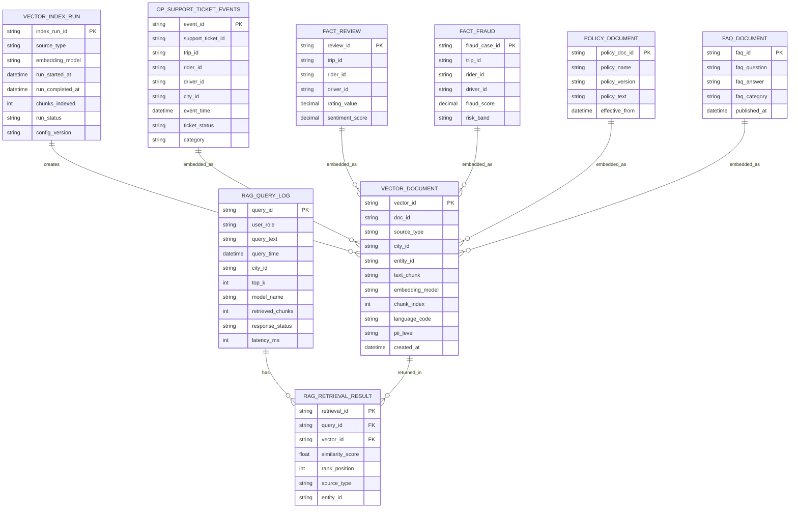

# ERD - Vector / RAG Semantic Model

```mermaid
erDiagram
    VECTOR_DOCUMENT {
        string vector_id PK
        string doc_id
        string source_type
        string city_id
        string entity_id
        string text_chunk
        string embedding_model
        int chunk_index
        string language_code
        string pii_level
        datetime created_at
    }

    VECTOR_INDEX_RUN {
        string index_run_id PK
        string source_type
        string embedding_model
        datetime run_started_at
        datetime run_completed_at
        int chunks_indexed
        string run_status
        string config_version
    }

    RAG_QUERY_LOG {
        string query_id PK
        string user_role
        string query_text
        datetime query_time
        string city_id
        int top_k
        string model_name
        int retrieved_chunks
        string response_status
        int latency_ms
    }

    RAG_RETRIEVAL_RESULT {
        string retrieval_id PK
        string query_id FK
        string vector_id FK
        float similarity_score
        int rank_position
        string source_type
        string entity_id
    }

    OP_SUPPORT_TICKET_EVENTS {
        string event_id PK
        string support_ticket_id
        string trip_id
        string rider_id
        string driver_id
        string city_id
        datetime event_time
        string ticket_status
        string category
    }

    FACT_REVIEW {
        string review_id PK
        string trip_id
        string rider_id
        string driver_id
        decimal rating_value
        decimal sentiment_score
    }

    FACT_FRAUD {
        string fraud_case_id PK
        string trip_id
        string rider_id
        string driver_id
        decimal fraud_score
        string risk_band
    }

    POLICY_DOCUMENT {
        string policy_doc_id PK
        string policy_name
        string policy_version
        string policy_text
        datetime effective_from
    }

    FAQ_DOCUMENT {
        string faq_id PK
        string faq_question
        string faq_answer
        string faq_category
        datetime published_at
    }

    VECTOR_INDEX_RUN ||--o{ VECTOR_DOCUMENT : creates
    RAG_QUERY_LOG ||--o{ RAG_RETRIEVAL_RESULT : has
    VECTOR_DOCUMENT ||--o{ RAG_RETRIEVAL_RESULT : returned_in

    OP_SUPPORT_TICKET_EVENTS ||--o{ VECTOR_DOCUMENT : embedded_as
    FACT_REVIEW ||--o{ VECTOR_DOCUMENT : embedded_as
    FACT_FRAUD ||--o{ VECTOR_DOCUMENT : embedded_as
    POLICY_DOCUMENT ||--o{ VECTOR_DOCUMENT : embedded_as
    FAQ_DOCUMENT ||--o{ VECTOR_DOCUMENT : embedded_as
```
