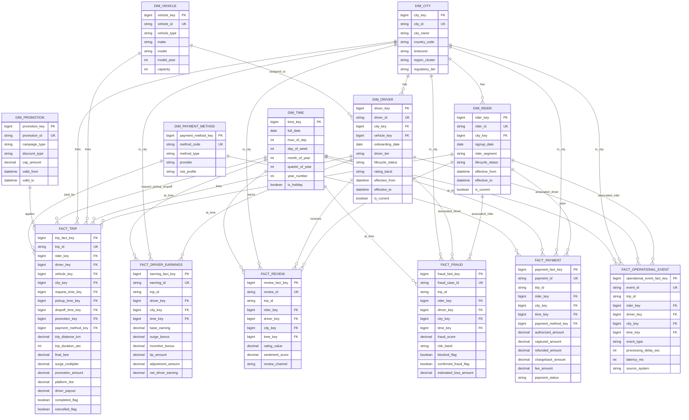

# ERD - Warehouse Star Schema

```mermaid
erDiagram
    DIM_RIDER {
        bigint rider_key PK
        string rider_id UK
        bigint city_key FK
        date signup_date
        string rider_segment
        string lifecycle_status
        datetime effective_from
        datetime effective_to
        boolean is_current
    }

    DIM_DRIVER {
        bigint driver_key PK
        string driver_id UK
        bigint city_key FK
        bigint vehicle_key FK
        date onboarding_date
        string driver_tier
        string lifecycle_status
        string rating_band
        datetime effective_from
        datetime effective_to
        boolean is_current
    }

    DIM_VEHICLE {
        bigint vehicle_key PK
        string vehicle_id UK
        string vehicle_type
        string make
        string model
        int model_year
        int capacity
    }

    DIM_CITY {
        bigint city_key PK
        string city_id UK
        string city_name
        string country_code
        string timezone
        string region_cluster
        string regulatory_tier
    }

    DIM_TIME {
        bigint time_key PK
        date full_date
        int hour_of_day
        int day_of_week
        int month_of_year
        int quarter_of_year
        int year_number
        boolean is_holiday
    }

    DIM_PROMOTION {
        bigint promotion_key PK
        string promotion_id UK
        string campaign_type
        string discount_type
        decimal cap_amount
        datetime valid_from
        datetime valid_to
    }

    DIM_PAYMENT_METHOD {
        bigint payment_method_key PK
        string method_code UK
        string method_type
        string provider
        string risk_profile
    }

    FACT_TRIP {
        bigint trip_fact_key PK
        string trip_id UK
        bigint rider_key FK
        bigint driver_key FK
        bigint vehicle_key FK
        bigint city_key FK
        bigint request_time_key FK
        bigint pickup_time_key FK
        bigint dropoff_time_key FK
        bigint promotion_key FK
        bigint payment_method_key FK
        decimal trip_distance_km
        int trip_duration_sec
        decimal final_fare
        decimal surge_multiplier
        decimal promotion_amount
        decimal platform_fee
        decimal driver_payout
        boolean completed_flag
        boolean cancelled_flag
    }

    FACT_DRIVER_EARNINGS {
        bigint earning_fact_key PK
        string earning_id UK
        string trip_id
        bigint driver_key FK
        bigint city_key FK
        bigint time_key FK
        decimal base_earning
        decimal surge_bonus
        decimal incentive_bonus
        decimal tip_amount
        decimal adjustment_amount
        decimal net_driver_earning
    }

    FACT_PAYMENT {
        bigint payment_fact_key PK
        string payment_id UK
        string trip_id
        bigint rider_key FK
        bigint city_key FK
        bigint time_key FK
        bigint payment_method_key FK
        decimal authorized_amount
        decimal captured_amount
        decimal refunded_amount
        decimal chargeback_amount
        decimal fee_amount
        string payment_status
    }

    FACT_REVIEW {
        bigint review_fact_key PK
        string review_id UK
        string trip_id
        bigint rider_key FK
        bigint driver_key FK
        bigint city_key FK
        bigint time_key FK
        decimal rating_value
        decimal sentiment_score
        string review_channel
    }

    FACT_FRAUD {
        bigint fraud_fact_key PK
        string fraud_case_id UK
        string trip_id
        bigint rider_key FK
        bigint driver_key FK
        bigint city_key FK
        bigint time_key FK
        decimal fraud_score
        string risk_band
        boolean blocked_flag
        boolean confirmed_fraud_flag
        decimal estimated_loss_amount
    }

    FACT_OPERATIONAL_EVENT {
        bigint operational_event_fact_key PK
        string event_id UK
        string trip_id
        bigint rider_key FK
        bigint driver_key FK
        bigint city_key FK
        bigint time_key FK
        string event_type
        int processing_delay_sec
        int latency_ms
        string source_system
    }

    DIM_CITY ||--o{ DIM_RIDER : has
    DIM_CITY ||--o{ DIM_DRIVER : has
    DIM_VEHICLE ||--o{ DIM_DRIVER : assigned_to

    DIM_RIDER ||--o{ FACT_TRIP : links
    DIM_DRIVER ||--o{ FACT_TRIP : links
    DIM_VEHICLE ||--o{ FACT_TRIP : links
    DIM_CITY ||--o{ FACT_TRIP : links
    DIM_TIME ||--o{ FACT_TRIP : request_pickup_dropoff
    DIM_PROMOTION ||--o{ FACT_TRIP : applies
    DIM_PAYMENT_METHOD ||--o{ FACT_TRIP : paid_by

    DIM_DRIVER ||--o{ FACT_DRIVER_EARNINGS : earns
    DIM_CITY ||--o{ FACT_DRIVER_EARNINGS : in_city
    DIM_TIME ||--o{ FACT_DRIVER_EARNINGS : at_time

    DIM_RIDER ||--o{ FACT_PAYMENT : pays
    DIM_CITY ||--o{ FACT_PAYMENT : in_city
    DIM_TIME ||--o{ FACT_PAYMENT : at_time
    DIM_PAYMENT_METHOD ||--o{ FACT_PAYMENT : via

    DIM_RIDER ||--o{ FACT_REVIEW : submits
    DIM_DRIVER ||--o{ FACT_REVIEW : receives
    DIM_CITY ||--o{ FACT_REVIEW : in_city
    DIM_TIME ||--o{ FACT_REVIEW : at_time

    DIM_RIDER ||--o{ FACT_FRAUD : associated_rider
    DIM_DRIVER ||--o{ FACT_FRAUD : associated_driver
    DIM_CITY ||--o{ FACT_FRAUD : in_city
    DIM_TIME ||--o{ FACT_FRAUD : at_time

    DIM_RIDER ||--o{ FACT_OPERATIONAL_EVENT : associated_rider
    DIM_DRIVER ||--o{ FACT_OPERATIONAL_EVENT : associated_driver
    DIM_CITY ||--o{ FACT_OPERATIONAL_EVENT : in_city
    DIM_TIME ||--o{ FACT_OPERATIONAL_EVENT : at_time
```
